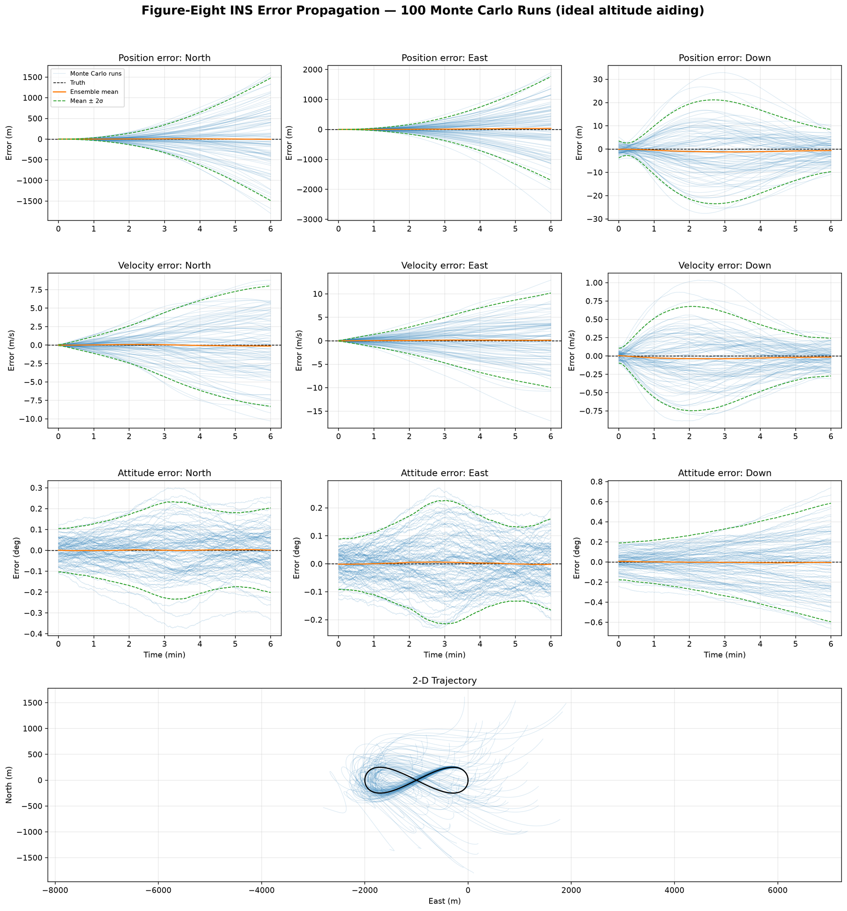

# Strapdown INS Monte Carlo Simulation

A configuration-driven simulator for studying how inertial sensor errors and
initial-condition uncertainty propagate through a strapdown inertial navigation
system. It generates a truth trajectory, synthesizes ideal IMU data by inverse
mechanization, applies sampled sensor errors, runs forward mechanization for an
ensemble of trials, and reports navigation-error statistics.

The implementation retains explicit Earth rotation, transport rate, Earth
curvature, Somigliana gravity, DCM propagation, and optional altitude aiding.
It is intended as a transparent simulation and analysis artifact rather than a
production navigation solution.

## Highlights

- Monte Carlo ensembles with deterministic seeds and reproducible TOML inputs.
- Figure-eight, circular, and stationary truth scenarios.
- Independent run-to-run distributions for initial NED position, velocity, and
  attitude errors, plus constant accelerometer and gyroscope biases.
- Stationary first-order Gauss-Markov bias drift, white ARW/VRW measurement
  noise, and nonstationary bias rate random walk on every sensor axis.
- One report page with nine position/velocity/attitude error panels and a 2-D
  trajectory overlay. Every error panel shows all runs, truth, ensemble mean,
  and mean ± 2σ bounds.
- Optional removal of altitude aiding to expose vertical-channel divergence.

## Quick Start

Python 3.11 or newer is required.

```bash
python -m venv .venv
source .venv/bin/activate
pip install -e .
ins-monte-carlo configs/figure_eight.toml
```

Or run the module without installing a console command:

```bash
PYTHONPATH=src python -m ins.cli configs/figure_eight.toml
```

## Local GUI

Launch the browser-based local GUI to edit every simulation, initial-state, and
sensor-error parameter without hand-writing TOML:

```bash
ins-monte-carlo-gui
```

The GUI binds only to `http://127.0.0.1:8765`, loads the included study
templates, downloads validated TOML when requested, runs simulations in the
background, and displays the generated report in the browser. Closing the
browser does not stop the local server; use the **Stop Local Server** button
or `Ctrl+C` in its terminal. Relaunching the command reconnects to an existing
GUI instance at the same port. Use
`ins-monte-carlo-gui --no-browser` to print the URL without opening it.

### GUI Controls

| Control | What it does |
| --- | --- |
| **Load a built-in study** | Selects one of the supplied figure-eight, circle, or stationary configurations. Selecting an item does not change the form until **Load Study** is pressed. |
| **Load Study** | Replaces every form value with the selected built-in study. Use this to begin from a documented baseline. |
| **Zero Error Inputs** | Sets every initial-state standard deviation, constant-bias standard deviation, FOGM standard deviation, ARW/VRW value, and bias-rate random-walk value to zero. It preserves the current simulation timing, trajectory, altitude-aiding setting, output directory, and FOGM correlation times. |
| **Download TOML** | Validates the current form and downloads the exact TOML configuration. It does not run a simulation. |
| **Altitude Aiding** | This checkbox in the **Simulation** section enables or disables the mechanizer's ideal altitude-aiding feedback. It replaces the former separate no-altitude-aiding study configuration. |
| **Run Monte Carlo** | Validates the form, starts the requested ensemble in the background, shows completed-run progress, writes the results to `output_dir`, and displays the PNG report with PDF and TOML links when complete. |
| **Stop Local Server** | Stops the local GUI process and frees its port. Use this only after a simulation completes; stopping it during a run interrupts that run. |

The GUI opens with a valid zero-error figure-eight setup: all error magnitudes
are zero, while the trajectory and sample timing remain nonzero so the study
can be run immediately.

Each run writes these reproducible artifacts to the configured `output_dir`:

- `monte_carlo_summary.pdf` and `monte_carlo_summary.png`
- `ensemble_statistics.npz`
- a copy of the input `config.toml`
- `metadata.json`

Generated output is intentionally ignored by Git.

## Representative Result

The baseline figure-eight configuration below shows all 100 sampled navigation
solutions, the zero-error truth reference, ensemble mean, and two-sigma bounds.
It provides a direct view of horizontal drift, vertical aiding behavior, and
attitude-error growth under the configured IMU model.



## Included Scenarios

| Configuration | Purpose |
| --- | --- |
| `configs/figure_eight.toml` | Baseline maneuvering trajectory and error propagation study. |
| `configs/circle.toml` | Circular trajectory with tangent heading and configurable fixed bank/pitch. |
| `configs/stationary_schuler.toml` | Stationary error-dynamics case that exposes Schuler-mode behavior. |

## Configuration Model

Every three-element vector follows North/East/Down order for navigation states
and body x/y/z order for IMU errors. All run-to-run distributions have a fixed
zero mean; the configured standard deviation defines each independent Gaussian
draw. Setting an error magnitude or standard deviation to zero removes that
term from the simulation.

```toml
[initial_error]
position_std = [1.0, 1.0, 2.0]         # m, NED
velocity_std = [0.05, 0.05, 0.05]      # m/s, NED
attitude_std_deg = [0.05, 0.05, 0.10]  # deg, NED error vector

[sensors.gyro]
constant_bias_std = [1e-5, 1e-5, 1e-5]
fogm_sigma = [5e-6, 5e-6, 5e-6]       # rad/s, stationary standard deviation
fogm_tau_s = [300.0, 300.0, 300.0]     # s
angle_random_walk = [3e-5, 3e-5, 3e-5]  # rad/sqrt(s), ARW
bias_rate_random_walk = [5e-7, 5e-7, 5e-7]  # rad/s/sqrt(s)
```

Accelerometer settings use `velocity_random_walk` rather than
`angle_random_walk`. Its units are `m/s/sqrt(s)` for VRW; bias and FOGM terms
use `m/s^2`, and `bias_rate_random_walk` uses `m/s^2/sqrt(s)`.

### Sensor Error Equations

For each sensor axis, the measurement error is the sum of four independent
terms:

```text
e[k] = b_constant + b_fogm[k] + n_white[k] + b_rrw[k]
```

- `b_constant` is drawn once per run from a zero-mean normal distribution with
  the configured standard deviation.
- `b_fogm` follows `b[k+1] = phi*b[k] + sigma*sqrt(1-phi^2)*w[k]`, where
  `phi = exp(-dt/tau)`, `w[k] ~ N(0,1)`, and `b[0] ~ N(0,sigma^2)`. This gives
  the desired stationary standard deviation from the first sample.
- `n_white[k] = density/sqrt(dt) * w[k]` is ARW for gyros or VRW for
  accelerometers.
- `b_rrw[k+1] = b_rrw[k] + intensity*sqrt(dt)*w[k]` is a nonstationary
  random-walk bias state.

ARW/VRW is white measurement noise; bias rate random walk is a slowly
accumulating sensor-bias error. Both are useful and intentionally modeled
separately.

The active implementation is centralized in `src/ins/noise.py`:

- `generate_stationary_fogm()` generates the stationary FOGM bias process.
- `generate_white_measurement_noise()` generates gyro ARW or accelerometer
  VRW, based on the sensor configuration.
- `generate_bias_rate_random_walk()` generates the nonstationary bias state.
- `generate_imu_error()` combines the four terms into the error added to one
  run's ideal IMU data.

## Error Definitions

Position errors are evaluated in a common local NED curvilinear frame and
velocity errors are estimated minus truth in NED coordinates. Attitude error is
the rotation-vector logarithm of

```text
C_error = C_nb_estimated @ C_nb_truth.T
```

so its components are resolved in NED and do not suffer Euler-angle wrapping.
The North and East components correspond to the usual tilt-error directions;
the Down component is heading error rather than tilt.

## Circle Attitude Assumption

The circular position path does not by itself define vehicle orientation.
The provided circle scenario aligns yaw to the horizontal velocity tangent:

```text
yaw = atan2(v_E, v_N)
```

Bank and pitch are explicit configuration inputs and default to zero. This
keeps the truth model agnostic to vehicle type. A coordinated-turn bank model
can be added later as an explicit scenario option if needed.

## Repository Layout

```text
configs/       Reproducible simulation inputs
src/ins/noise.py       IMU stochastic error-process implementation
src/ins/scenarios.py   Truth trajectories and ideal IMU generation
src/ins/monte_carlo.py Ensemble propagation and error statistics
src/ins/reporting.py   Ten-panel Monte Carlo result figure and output artifacts
src/ins/               Earth model, rotations, mechanization, configuration, and CLI
tests/         Deterministic configuration, stochastic-model, and metric tests
```

## Next Extensions

- Sensor-grade comparison configurations with documented source specifications.
